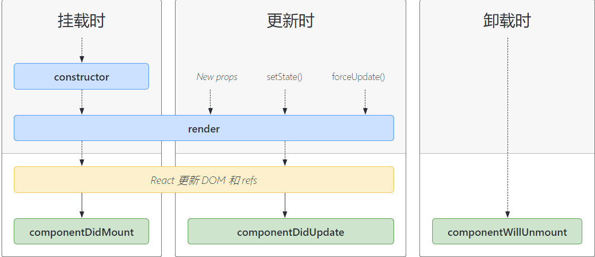

# 创建一个react项目

## 脚手架创建 

```
npx create-react-app demo
```

## 安装sass

react脚手架已经安装了sass-loader解析，就不需要安装了

```
npm install node-sass --save
```

## 安装并使用antd

```
npm install antd --save // 安装
import { Input,Button } from 'antd' // 导入需要的组件
import 'antd/dist/antd.css' // 导入css
```

## 安装 axios

```
import axios from 'axios'
...
axios.get('./data.json') // 如果没有配置，那么指向的是public里的
...
```

## 安装 router 

```
npm install react-router-dom --save
```

**两种模式:** BrowerRouter HashRouter

**匹配路由:**  Switch  **精准匹配：**exact

**导入路由要加载的组件模板**

```
import React from 'react'
import {HashRouter as Router,Route,Switch} from 'react-router-dom'
import *** from *** 
```

**匹配**

```
<Router>
    <Switch>
        <Route exact path="/" component={App}></Route>
        <Route exact path="/login" component={Login}></Route>
        <Route exact path="/home" component={Home}></Route>
        <Route exact path="/detail/id=:id" component={Detail}></Route>
        <Route path="*" component={Err}></Route>  {/* 其他路径匹配不到 就执行这个 */}
    </Switch>
</Router>
```

**link 跳转 解析为 a 标签**

```
import {Link} from 'react-router-dom' // 导入
...
<Link to="/login">点击进入登录页面</Link> 
...
```

## React Hook

### useState 状态

```
import React ,{useState} from 'react'
...
const [count,setCount] = useState(5) // 右侧括号内容为初始值
...
const countUpdate = () =>{
	return setCount(count++)
}
<button onclick={countUpdate}>点击++</button>
```

### useEffect  副作用钩子

useEffect相当于`componentDidMount`和`componentUpdate`,第一个参数是执行的异步函数，第二个参数是一个数组，只要这个数组发生变化，useEffect就会触发,如果是空数组，那么只会在第一次加载的时候触发

```
import React ,{useState} from 'react'
useEffect(()=>{
	// 通常做异步请求
},[]) // 组件加载或者数据发生改变的时候
```

### 在 react 中如何遍历数组

```
<ul>
  {
    list.map((item,index)=>{
    return <li key={index}>{item}</li>
    })
  }
</ul>
```

### 行内样式style

在jsx语法中添加行内样式，第一个 {} 是 jsx语法 ，第二个 是style 样式、

```
style={{listStyle: "none"}} // 驼峰样式，后面双引号，多个样式用逗号隔开
```

**等同于**

```
const styleObj = {
	listStyle: "none"
}
...
style={styleObj} // 并不是必须要两个大括号，第一个才是语法糖，第二个只是对象
```

## react生命周期

**组件被实例创建并插入到DOM中**

`constructor`

`static getDerivedStateFormProps()`

`render()`

`componentDidMount`

**更新**

`static getDerivedStateFormProps()`

`shouldComponentUpdate()`

`render()`

`getSnapshotBeforeUpdate()`

`componentDidUpdate()`

避免使用 `componentWillUpdate`和`componentWillReceiveProps()`

卸载

`componentWillmount()`

错误处理

`static getDerivedStateFromError()` 和 `componentDidCatch`

**图片**



